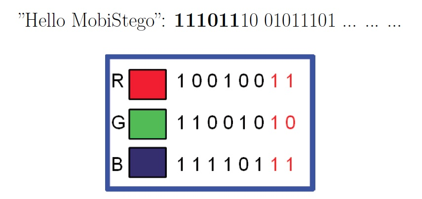

MobiStego
=========

Android application implements the steganographic algorithm LSB on the last 2 bit for channel.

LSB (Less significant bit)
-------------------------
The algorithm analyzes every pixel, and for every pixel it takes the three channels RGB. 
Every channel has coded in 8 bit (1 byte) so values are 0-255. Now, if you read the message (to hide) like a bits sequence, 
every 2 bit I replace the less significant bit of the current channel and so on.

    First pixel: R G B
    Second pixel: R G B
    ...
    
The algorithm stops when the message bits sequence has finished. I'll attach an image example.
The problem of this approach was the size of the pixel matrix, but I solved the problem with a bufferied strategy (Split & Merge)

The following image shows how it works at bit level:

